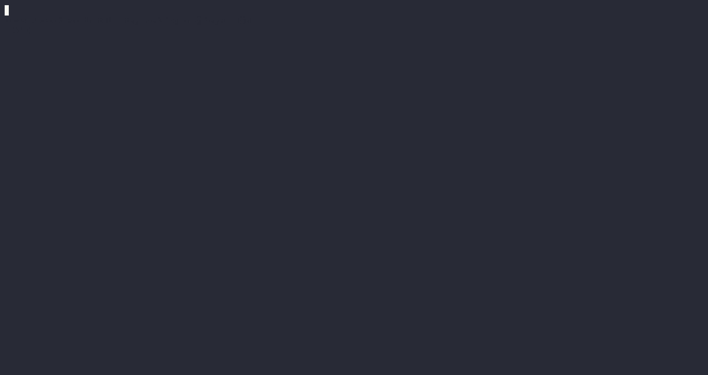

<div class="oranda-hide">
    <h1 align="center">wr</h1>
    <div align="center">
        <strong>
        一个 Rust 练习运行器（已汉化）
        </strong>
    </div>
    <div align="center">
        <!-- Crates version -->
        <a href="https://crates.io/crates/cargo-px">
            
        </a>
        <!-- Downloads -->
        <a href="https://crates.io/crates/cargo-px">
            
        </a>
    </div>
</div>

<br />



`wr` 是一个用于驱动测试驱动式 Rust 工作坊的 CLI 工具（已汉化）。
它设计用于与工作坊仓库配合使用，仓库中包含一系列供学员解答的练习。

> 💡 本工具与 [100-exercises-to-learn-rust（汉化版）](https://github.com/leiyihai/100-exercises-to-learn-rust) 搭配使用。该仓库是完整的 Rust 入门课程，包含 100 个练习，均配有中文文档和注释。
>
> 原版工具由 [Mainmatter](https://mainmatter.com/rust-consulting/) 开发，用于支持其 [Rust 实践工作坊](https://mainmatter.com/services/workshops/rust/)。

<div class="oranda-hide">
    
## 如何安装

参考[发布页面](https://mainmatter.github.io/rust-workshop-runner/)上的说明，或直接：

```bash
cargo install --locked workshop-runner
```

如果希望使用汉化版，可从本仓库源码编译安装：

```bash
git clone https://github.com/leiyihai/rust-workshop-runner.git
cd rust-workshop-runner
cargo install --locked --path .
```
</div>

## 工作原理

> 我不能创造的，我便不能理解。
>
> —— 理查德·费曼

一个测试驱动的工作坊由一系列练习组成。
每个练习都是一个 Rust 项目，附带一组用于验证解答正确性的测试。

`wr` 会运行当前练习的测试，测试通过后允许你进入下一个练习，
同时记录你已完成的进度。

你可以在 [rust-telemetry-workshop](https://github.com/mainmatter/rust-telemetry-workshop) 中看到它的实际效果。

## 安装

```bash
cargo install --locked workshop-runner
```

验证安装是否成功：

```bash
wr --help
```

## 使用

在工作坊仓库的顶级目录中运行：

```bash
wr
```

来验证当前练习的解答并继续前进。

你也可以导航到特定练习，然后在其目录中运行 `wr check` 来验证解答，
无论当前练习是什么。

### 持续检查

你可以将 `wr` 与 [`cargo-watch`](https://crates.io/crates/cargo-watch) 结合使用，
每次修改代码后自动重新检查解答：

```bash
cargo watch -- wr
```

## 目录结构

`wr` 期望工作坊仓库具有以下结构：

```
.
├── exercises
│  ├── 00_<合集名称>
│  │  ├── 00_<练习名称>
│  │  │  ..
│  │  ├── 0n_<练习名称>
│  │  ..
│  ├── 0n_<合集名称>
│  │  ├── 00_<练习名称>
│  │  │  ..
│  │  ├── 0n_<练习名称>
```

每个 `xx_<练习名称>` 文件夹必须是一个包含自己 `Cargo.toml` 文件的 Rust 项目。

你可以通过创建顶级 `.wr.toml` 文件来选择不同的顶级文件夹名称：

```toml
exercises_dir = "my-top-level-folder"
```

可以参考 [rust-telemetry-workshop](https://github.com/mainmatter/rust-telemetry-workshop) 作为示例。
